# Multilanguage-PowerBI-Project

<table>
  <tr>
    <td>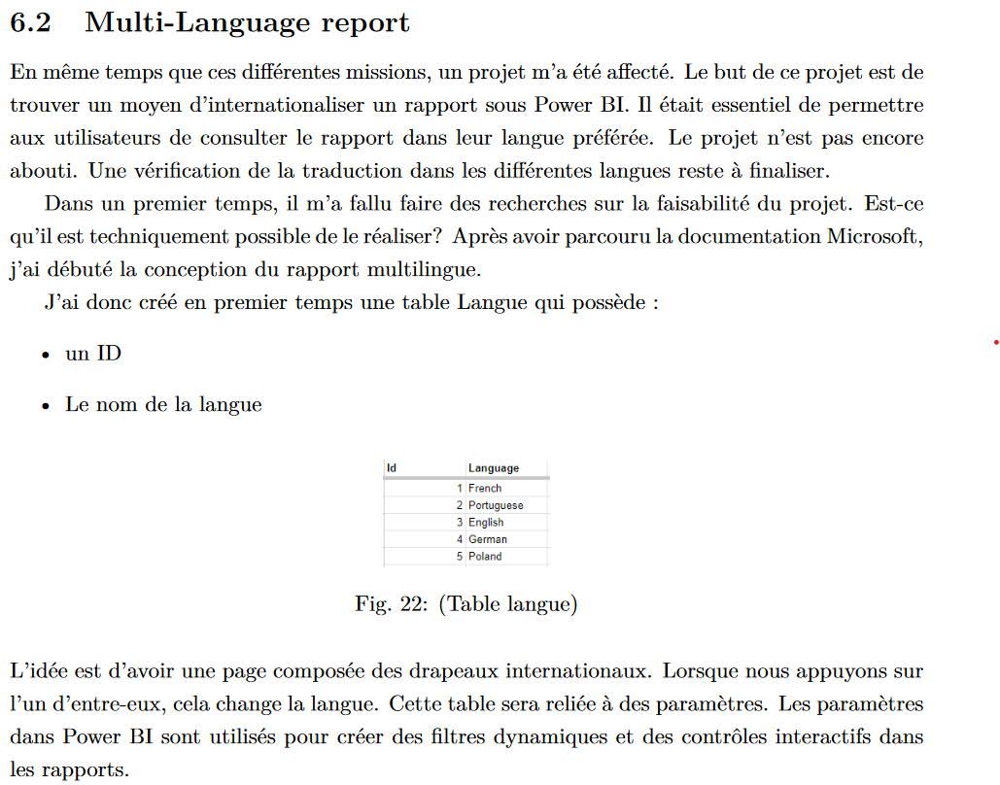</td>
  </tr>
</table>
<table>
  <tr>
    <td>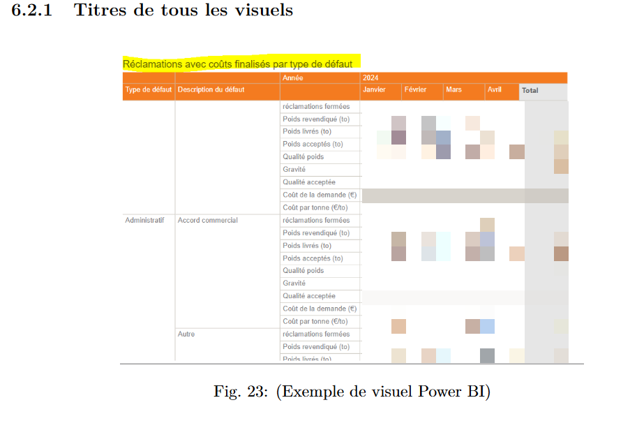</td>
  </tr>
</table>
<table>
  <tr>
    <td>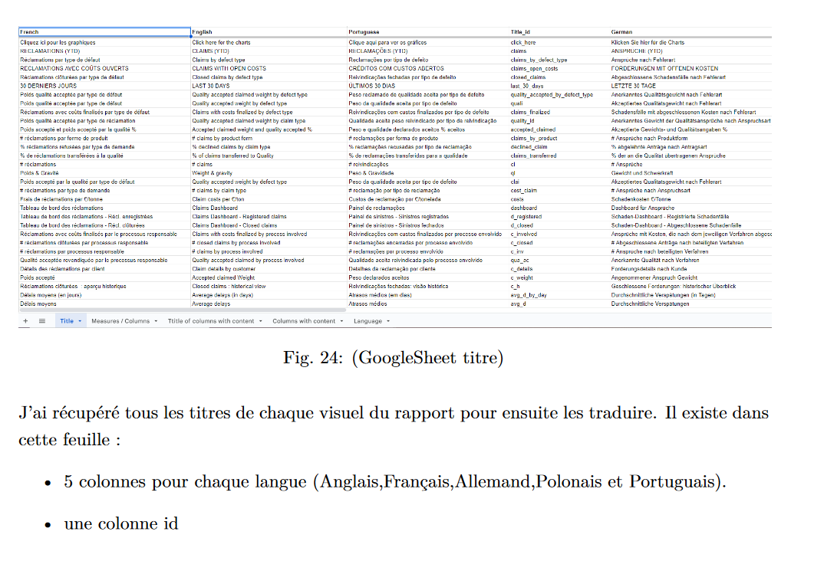</td>
  </tr>
</table>
<table>
  <tr>
    <td>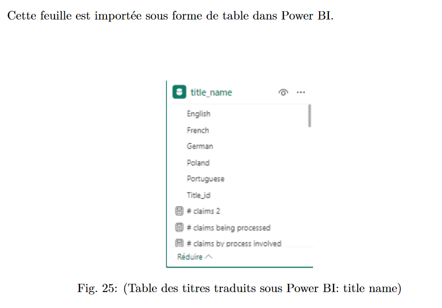</td>
  </tr>
</table>
<table>
  <tr>
    <td>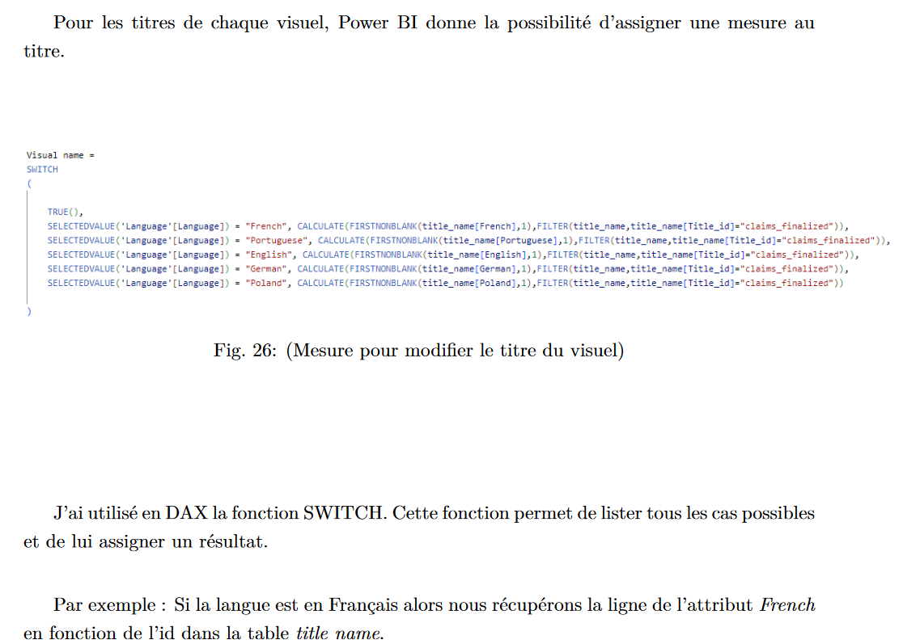</td>
  </tr>
</table>
<table>
  <tr>
    <td></td>
  </tr>
</table>
<table>
  <tr>
    <td></td>
  </tr>
</table>
<table>
  <tr>
    <td>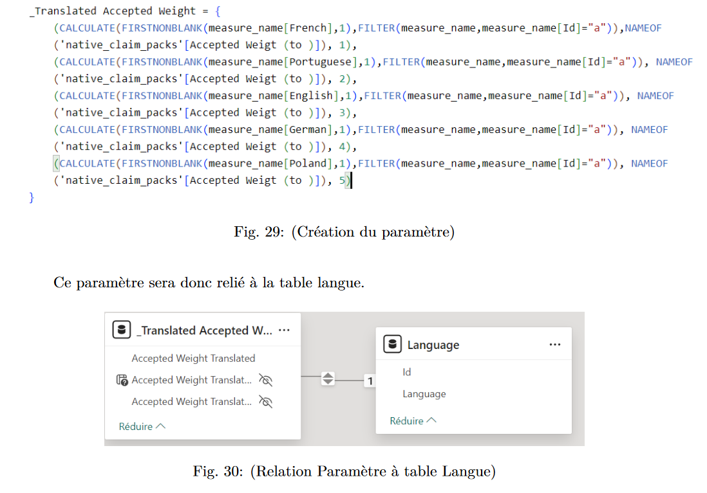</td>
  </tr>
</table>
<table>
  <tr>
    <td>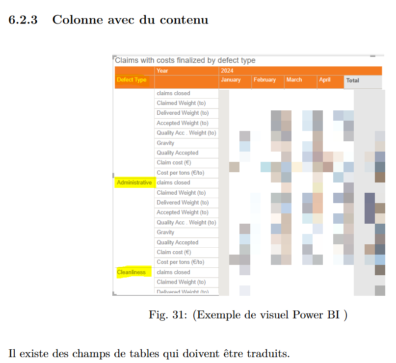</td>
  </tr>
</table>
<table>
  <tr>
    <td>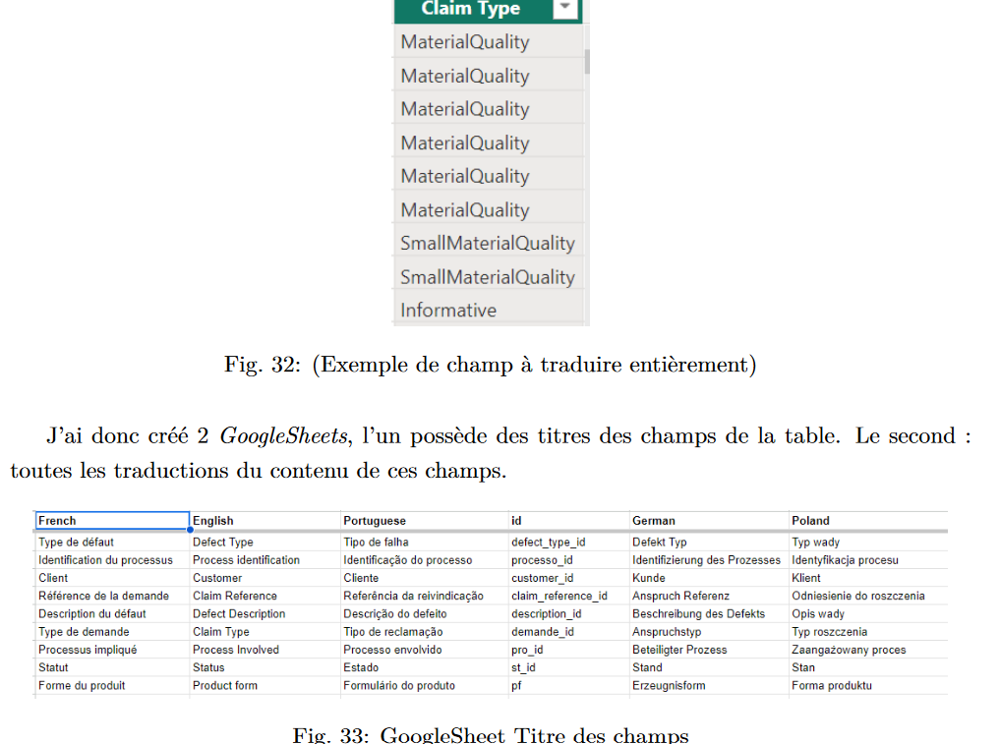</td>
  </tr>
</table>
<table>
  <tr>
    <td>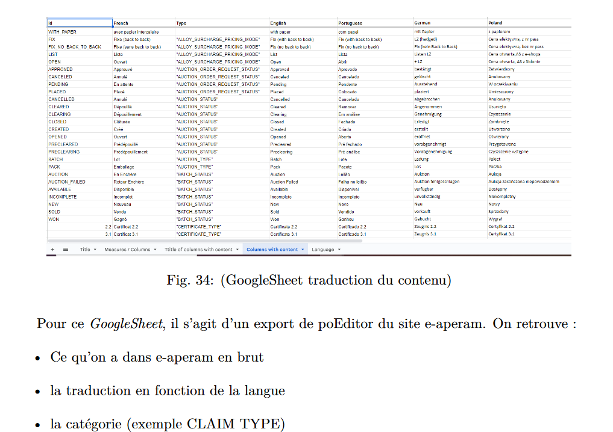</td>
  </tr>
</table>
<table>
  <tr>
    <td>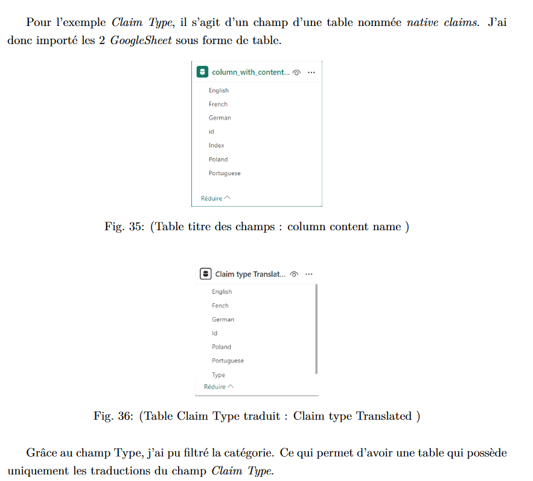</td>
  </tr>
</table><table>
  <tr>
    <td>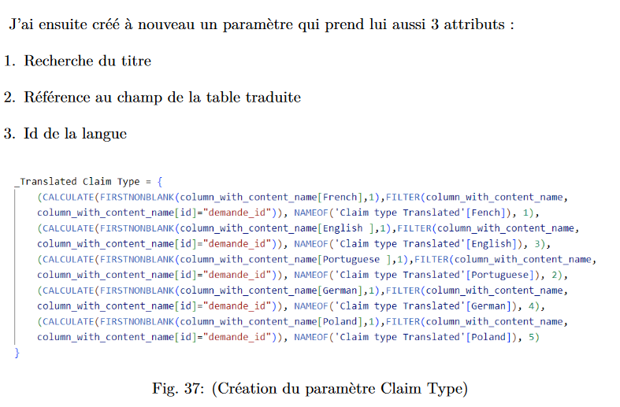</td>
  </tr>
</table><table>
  <tr>
    <td>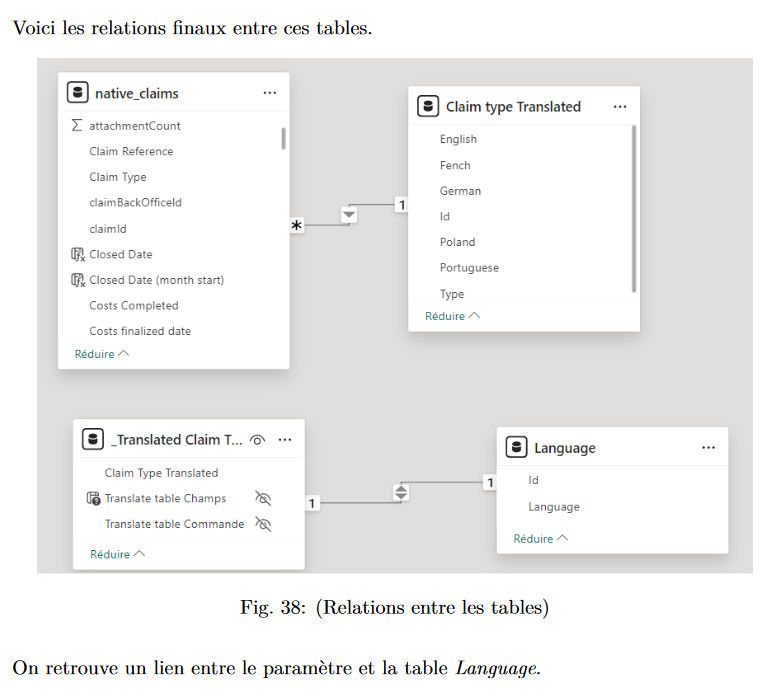</td>
  </tr>
</table><table>
  <tr>
    <td>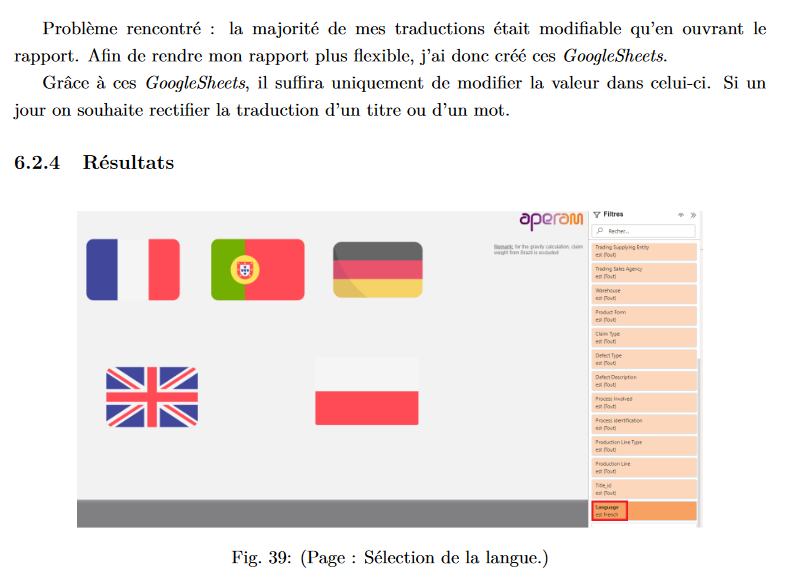</td>
  </tr>
</table>
<table>
  <tr>
    <td>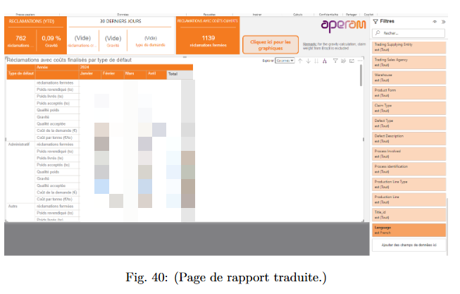</td>
  </tr>
</table>
